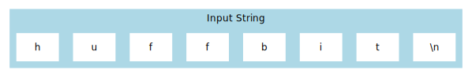
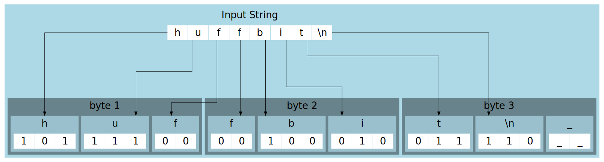

# Huffbit

Huffbit is a command-line program written in Go that implements Huffman coding for data compression

## About

- Huffman code is a type of optimal prefix code that supports lossless data compression by assigning variable length codes to the characters of a file.
- Most frequent characters are given a shorter code, while comparatively larger codes are given to uncommon characters, thus reducing file size optimally.
- This is done by counting all the characters in a file, then constructing a Huffman Tree for assigning values to them.
- These codes are then written bit by bit to the output file.

## Features

- Implements the classic Huffman coding algorithm.
- Supports compression and decompression of byte data.
- Leverages Go's standard library packages for efficient file handling and data structures.

## Usage

### Requirements:

The Go programming language installed on your system.

### Installation:

```bash
git clone https://github.com/ary82/huffbit.git && cd huffbit
```

### Build:

```bash
go build
```

This will create an executable in your current directory.
(Optionally add this file to your path)

### Use:

```bash
# Compress a file
./huffbit -c /your/txt/file
# Decompress a file
./huffbit -c /your/txt/file.huffbit
```

or if you've added the executable to your path,

```bash
# Compress a file
huffbit -c /your/txt/file
# Decompress a file
huffbit -c /your/txt/file.huffbit
```

## Working

Let's take the input string "huffbit":

<p align="center">
    
</p>

This program makes the following huffman tree:

<p align="center">
    
</p>

The Codes for the characters will be generated as:

| Character | Code |
| --------- | ---- |
| f         | 00   |
| i         | 010  |
| t         | 011  |
| b         | 100  |
| h         | 101  |
| newline   | 110  |
| u         | 111  |

After Writing the necessary headers, the encoded characters will be written to the output file:

<p align="center">
    
</p>

After compression, we can see the bytes needed get reduced from 8 in "huffbit\n" to just 3 in the compressed file, making it a theoretical compression of 62%
